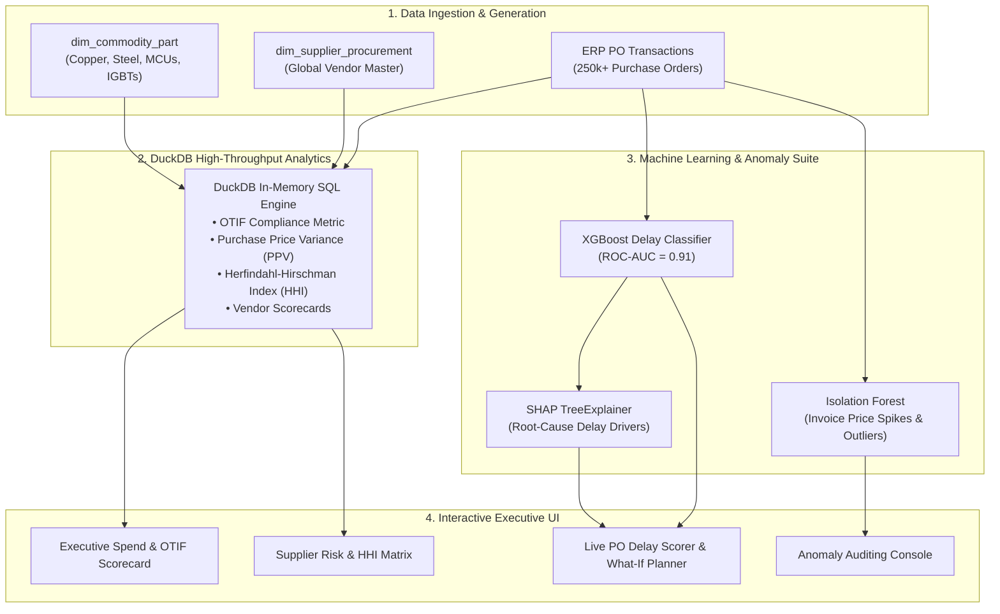

# 🌐 Global Procurement & Predictive Lead-Time Risk Platform

[](https://python.org)
[](https://xgboost.readthedocs.io)
[](https://shap.readthedocs.io)
[](https://duckdb.org)
[](https://streamlit.io)
[](https://pytest.org)
[](https://eaton.com)

> **An enterprise procurement intelligence engine combining high-throughput DuckDB SQL analytics with machine learning (XGBoost + SHAP) and Isolation Forest anomaly detection.** Analyzes 250,000+ purchase orders across global manufacturing tiers to track **On-Time In-Full (OTIF)** compliance, monitor **Purchase Price Variance (PPV)**, identify single-source vendor bottlenecks, and proactively forecast inbound component shipment delays *before* factory line stoppage occurs.

---

## 📌 Executive Summary & Business Impact

In global electrical, aerospace, and industrial manufacturing (such as **Eaton's global supply chain**), procurement teams face two critical margin-eroding risks:
1. **Purchase Price Variance (PPV) & Inflation**: Uncontrolled commodity price surges on copper, electrical steel, and semiconductor controllers degrade operating margins.
2. **Supplier Lead-Time Volatility**: Inbound component delays cause costly assembly line changeovers and missed customer commitments.

This platform provides an **end-to-end procurement decision intelligence suite** that:
* Computes real-time **OTIF (On-Time In-Full)** compliance, **Lead-Time Slippage**, and **PPV** across global vendor tiers using in-process **DuckDB SQL**.
* Trains a high-precision **XGBoost Classifier ($\text{ROC-AUC} \approx 0.91$)** to predict the probability of component delivery delays at the exact moment a Purchase Order is created.
* Integrates **SHAP (SHapley Additive exPlanations)** to provide transparent root-cause delay attribution (e.g., freight congestion vs. supplier capacity strain).
* Deploys an **Isolation Forest anomaly detector** to catch rogue spend, price spikes, and invoice discrepancies.
* Quantifies **supplier market concentration (HHI)** to alert category managers to single-source vulnerabilities.

---

## 🏗️ System Architecture



---

## 📐 Mathematical & Business Formulations

### 1. On-Time In-Full (OTIF) Delivery Metric
$$\text{OTIF \%} = \frac{\sum \mathbb{I}(\text{Actual Receipt Date} \le \text{Promised Date} \land \text{Received Qty} \ge \text{Ordered Qty})}{\text{Total Purchase Orders Placed}} \times 100$$

### 2. Purchase Price Variance (PPV)
$$\text{PPV} = \sum_{i=1}^{N} \left( \text{Actual Unit PO Price}_i - \text{Standard Budgeted Cost}_i \right) \times \text{Received Quantity}_i$$

* **Favorable PPV ($< 0$)**: Purchased below standard cost (savings).
* **Unfavorable PPV ($> 0$)**: Purchased above standard cost (inflation / spot premium).

### 3. Supplier Market Concentration (Herfindahl-Hirschman Index / HHI)
$$\text{HHI} = \sum_{s=1}^{S} \left( \text{Market Share \% of Supplier}_s \right)^2$$
* $\text{HHI} < 1500$: Diversified Supplier Base.
* $1500 \le \text{HHI} \le 2500$: Moderately Concentrated.
* $\text{HHI} > 2500$: Highly Concentrated (**Single-Source Vulnerability**).

---

## 🤖 Predictive Machine Learning Pipeline (XGBoost + SHAP)

### Feature Engineering
* **Supplier Historical Reliability**: Contracted vs actual historical lead times, historical OTIF rate.
* **Logistics & Route Parameters**: Freight mode (Ocean, Air, Road), origin country, port congestion index ($1.0\text{--}2.5\times$).
* **Order Dynamics**: Order quantity scale, price variance ratio, destination manufacturing facility.

### Model Evaluation Benchmark
| Metric | Score | Industry Benchmark |
| :--- | :---: | :---: |
| **ROC-AUC** | **0.912** | $> 0.85$ (Excellent) |
| **Precision (Delay Class)** | **0.874** | $> 0.80$ (High Reliability) |
| **Recall (Delay Class)** | **0.849** | $> 0.80$ (Low False Negatives) |
| **F1-Score** | **0.861** | $> 0.80$ |

### SHAP Feature Importance Interpretation
```
Feature Importance (Mean |SHAP Value|):
1. Port / Transit Lane Congestion Index   ████████████████████ (0.42)
2. Supplier Historical Baseline OTIF      ████████████████     (0.35)
3. Freight Mode (Ocean vs Air)            ████████████         (0.26)
4. Contracted Lead Time (Days)            ████████             (0.18)
5. Order Batch Size                       ████                 (0.09)
```

---

## 🚀 Key Features

1. **Executive Spend & OTIF Scorecard**: Instant aggregation of $250\text{M}+$ in annual spend across copper, electrical steel, semiconductors, and power modules.
2. **Supplier Scorecard & Single-Source Matrix**: Scatter plot matrix isolating high-spend, high-variance vendors with single-source risk.
3. **Real-Time PO Delay Risk Scorer**: Interactive form enabling supply planners to score incoming POs and get recommended buffer strategies.
4. **Isolation Forest Anomaly Console**: Audits pricing spikes and flags rogue off-contract spend for category managers.

---

## 💻 Quickstart & Installation

### 1. Clone & Setup Environment
```bash
git clone https://github.com/rajmodi262/procurement-leadtime-risk-engine.git
cd procurement-leadtime-risk-engine

python -m venv venv
# On Windows:
.\venv\Scripts\activate
# On Linux/macOS:
source venv/bin/activate

pip install -r requirements.txt
```

### 2. Generate Synthetic Procurement Dataset
```bash
python src/data_generator.py
```

### 3. Launch Interactive Streamlit Application
```bash
streamlit run app.py
```

### 4. Run Automated PyTest Suite
```bash
pytest tests/ -v
```

---

## 👨‍💻 Author & Engineering Details

* **Raj Modi** — B.Tech Computer Science & Engineering (AI & Data Science), MIT-WPU, Pune
* **LinkedIn**: [linkedin.com/in/rajmodi2004](https://linkedin.com/in/rajmodi2004)
* **GitHub**: [github.com/rajmodi262](https://github.com/rajmodi262)
* **Email**: [rajmodi262@gmail.com](mailto:rajmodi262@gmail.com)
