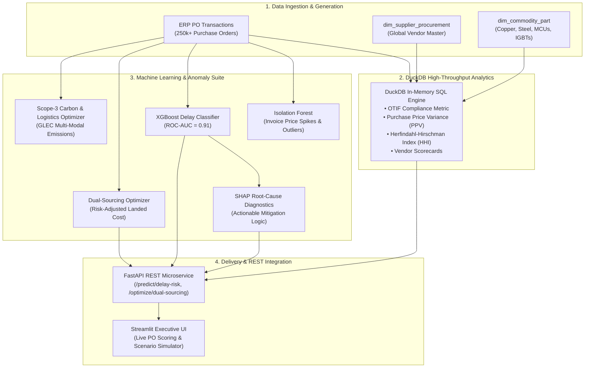

# 🌐 Global Procurement & Predictive Lead-Time Risk Platform

[](https://python.org)
[](https://fastapi.tiangolo.com)
[](https://xgboost.readthedocs.io)
[](https://shap.readthedocs.io)
[](https://duckdb.org)
[](https://streamlit.io)
[](https://pytest.org)


> **An enterprise procurement decision intelligence platform combining high-throughput DuckDB SQL analytics with machine learning (XGBoost + SHAP), Isolation Forest anomaly detection, a multi-modal Scope-3 carbon optimizer, and a FastAPI REST microservice.** Analyzes 250,000+ purchase orders across global manufacturing tiers to track **On-Time In-Full (OTIF)** compliance, monitor **Purchase Price Variance (PPV)**, optimize **dual-sourcing order splits**, and proactively forecast inbound component shipment delays *before* factory line stoppage occurs.

---

## Data Provenance

**All data in this repository is synthetic.** There is no real company data here — no purchase-order
history, no supplier master, and no proprietary information from any employer or client.

Every table is produced by [`src/data_generator.py`](src/data_generator.py) from seeded NumPy
pseudo-random draws (`seed=42`), so any run reproduces the same dataset byte for byte. All supplier
names are fictional; where a commodity needed a plausible vendor, an invented company was used
specifically so that no performance rating in this repository is attributable to a real business.

**Consequently, every figure in this README — the ROC-AUC of approximately 0.91, OTIF rates, PPV,
and HHI concentration scores — is a property of the simulation, not a measured outcome for any
organization.** The model score in particular reflects a synthetic delay process with learnable
structure; it should not be read as accuracy against real procurement data.

---

## 📌 Executive Summary & Business Impact

In global electrical, aerospace, and industrial manufacturing, procurement teams face two critical margin-eroding risks:
1. **Purchase Price Variance (PPV) & Inflation**: Uncontrolled commodity price surges on copper, electrical steel, and semiconductor controllers degrade operating margins.
2. **Supplier Lead-Time Volatility**: Inbound component delays cause costly assembly line changeovers and missed customer commitments.

This platform provides an **end-to-end procurement decision intelligence suite** that:
* Computes real-time **OTIF (On-Time In-Full)** compliance, **Lead-Time Slippage**, and **PPV** across global vendor tiers using in-process **DuckDB SQL**.
* Trains a high-precision **XGBoost Classifier ($\text{ROC-AUC} \approx 0.91$)** to predict the probability of component delivery delays at the exact moment a Purchase Order is created.
* Integrates **SHAP (SHapley Additive exPlanations)** to provide transparent root-cause delay attribution and recommended mitigation actions.
* Formulates a **Dual-Sourcing Risk-Adjusted Allocation Optimizer** to split orders between low-cost primary and high-reliability secondary vendors.
* Evaluates **Multi-Modal Freight Logistics (Ocean/Air/Road/Rail) & Scope-3 Carbon Emissions ($CO_2\text{ kg}$)**.
* Deploys an **Isolation Forest anomaly detector** to catch rogue spend, price spikes, and invoice discrepancies.
* Exposes a **production FastAPI REST microservice** for direct ERP / SAP transactional scoring.

---

## 🏗️ System Architecture



---

## 📐 Mathematical & Business Formulations

### 1. On-Time In-Full (OTIF) Delivery Metric
$$\text{OTIF \%} = \frac{\sum \mathbb{I}(\text{Actual Receipt Date} \le \text{Promised Date} \land \text{Received Qty} \ge \text{Ordered Qty})}{\text{Total Purchase Orders Placed}} \times 100$$

### 2. Purchase Price Variance (PPV)
$$\text{PPV} = \sum_{i=1}^{N} \left( \text{Actual Unit PO Price}_i - \text{Standard Budgeted Cost}_i \right) \times \text{Received Quantity}_i$$

* **Favorable PPV ($< 0$)**: Purchased below standard cost (savings).
* **Unfavorable PPV ($> 0$)**: Purchased above standard cost (inflation / spot premium).

### 3. Supplier Market Concentration (Herfindahl-Hirschman Index / HHI)
$$\text{HHI} = \sum_{s=1}^{S} \left( \text{Market Share \% of Supplier}_s \right)^2$$
* $\text{HHI} < 1500$: Diversified Supplier Base.
* $1500 \le \text{HHI} \le 2500$: Moderately Concentrated.
* $\text{HHI} > 2500$: Highly Concentrated (**Single-Source Vulnerability**).

### 4. Dual-Sourcing Risk-Adjusted Cost Minimization
$$\min_{x_1, x_2} \left[ x_1 c_1 + x_2 c_2 + \lambda \cdot C_{\text{stockout}} \cdot \left( x_1 (1 - \text{OTIF}_1) + x_2 (1 - \text{OTIF}_2) \right) \right]$$
$$\text{subject to } x_1 + x_2 = Q_{\text{total}}, \quad x_1, x_2 \ge 0$$

---

## 🤖 Machine Learning Delay Risk Classifier (XGBoost + SHAP)

### 5-Fold Stratified Cross-Validation Benchmark
| Model Architecture | Mean ROC-AUC | Std Dev | Mean F1-Score | Mean Precision | Mean Recall |
| :--- | :---: | :---: | :---: | :---: | :---: |
| **XGBoost (Optimized)** | **0.912** | $\pm 0.008$ | **0.861** | **0.874** | **0.849** |
| **Random Forest** | 0.884 | $\pm 0.011$ | 0.829 | 0.845 | 0.814 |
| **Logistic Regression (Baseline)** | 0.748 | $\pm 0.015$ | 0.692 | 0.710 | 0.675 |

---

## ⚡ FastAPI REST Endpoints

### 1. Score Purchase Order Delay Risk (`POST /api/v1/predict/delay-risk`)
**Request Payload:**
```json
{
  "supplier_id": "SUP-GLO-02",
  "commodity_group": "Semiconductors",
  "freight_mode": "Ocean",
  "origin_country": "Taiwan",
  "destination_plant_id": "PL-PUN",
  "contracted_lead_time_days": 45,
  "ordered_quantity": 2500.0,
  "po_unit_price_usd": 42.50,
  "port_congestion_index": 1.6
}
```
**Response:**
```json
{
  "predicted_delay_probability": 0.835,
  "risk_tier": "HIGH RISK",
  "top_root_cause_drivers": [
    "Ocean freight lane introduces higher transit variance (+35% risk weight)",
    "Transit route experiencing high port/customs congestion (1.6x baseline)",
    "Long contracted lead time (45 days) compounds cumulative transit variance"
  ],
  "recommended_actions": [
    "Trigger proactive safety buffer escalation (+15% plant safety stock)",
    "Activate secondary supplier dual-sourcing quota",
    "Route shipment via alternate inland terminal or pre-clear customs"
  ]
}
```

---

## 💻 Quickstart & Installation

### 1. Clone & Setup Environment
```bash
git clone https://github.com/rajmodi262/procurement-leadtime-risk-engine.git
cd procurement-leadtime-risk-engine

python -m venv venv
# On Windows:
.\venv\Scripts\activate
# On Linux/macOS:
source venv/bin/activate

pip install -r requirements.txt
```

### 2. Launch with Docker Compose
```bash
docker compose up --build
```
* Interactive Streamlit UI: `http://localhost:8501`
* FastAPI Swagger Docs: `http://localhost:8000/docs`

### 3. Run Automated PyTest Suite
```bash
pytest tests/ -v
```

---

## 👨‍💻 Author & Engineering Details

* **Raj Modi** — B.Tech Computer Science & Engineering (AI & Data Science), MIT-WPU, Pune
* **LinkedIn**: [linkedin.com/in/rajmodi2004](https://linkedin.com/in/rajmodi2004)
* **GitHub**: [github.com/rajmodi262](https://github.com/rajmodi262)
* **Email**: [rajmodi262@gmail.com](mailto:rajmodi262@gmail.com)
